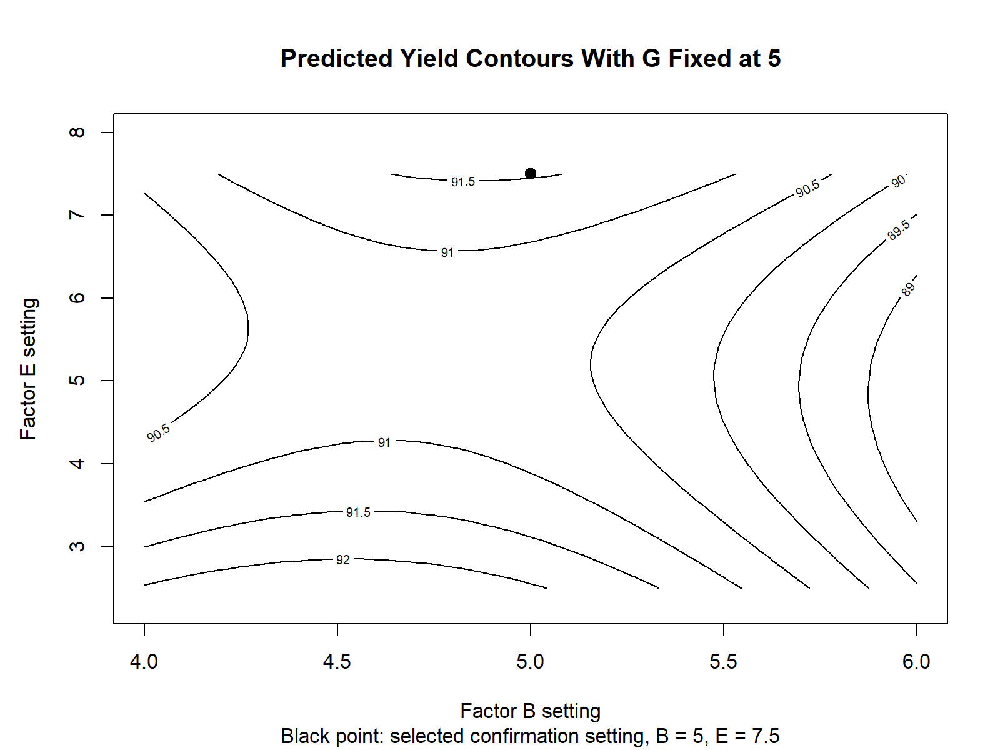
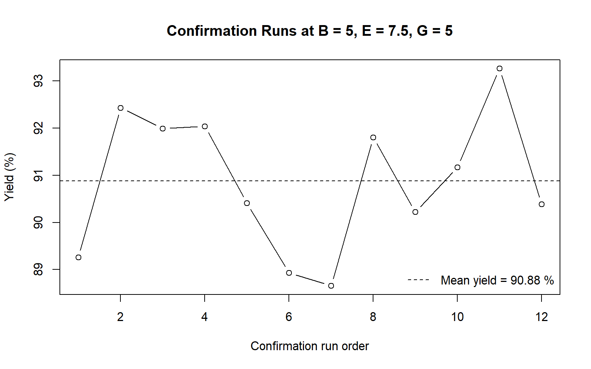

# Chemical Process Yield Optimization

Sequential design-of-experiments case study in R.

## Overview

Individual graduate applied-statistics project focused on improving the yield of an instructor-provided chemical-process model.

I designed and analyzed six sequential experiments under a 75-run budget. Each experiment informed the next, moving from broad eight-factor screening to a focused response-surface study and confirmation testing.

**Result:** improved confirmed mean yield from an approximately 50% baseline to **90.88%**.

## Objective

Identify influential process factors and determine a high-yield operating region while using limited experimental runs efficiently.

## Experimental Strategy

The process included eight continuous factors, labeled A through H.

1. **Initial screening:** 16-run Resolution IV fractional-factorial design across eight factors
2. **Follow-up factorial:** 8-run study focused on B, D, and F
3. **B-level refinement:** 4-run comparison to refine factor B
4. **Regional factorial study:** 8-run factorial design plus 4 center-point replicates for B, E, and G
5. **Response-surface expansion:** 6 axial runs completing a face-centered central composite design
6. **Confirmation:** 12 independent runs at the selected operating setting

**Total experimental runs used: 58 of 75 available**

## Methods

* Fractional-factorial screening
* Lenth's pseudo standard error for unreplicated designs
* Factorial effect and interaction analysis
* Center-point analysis
* Face-centered central composite design
* Quadratic response-surface modeling
* Stationary-point analysis
* Confirmation runs with confidence and prediction intervals

## Key Results

| Metric                                     |                Result |
| ------------------------------------------ | --------------------: |
| Experimental-run budget                    |               75 runs |
| Experimental runs used                     |               58 runs |
| Selected confirmation setting              | B = 5, E = 7.5, G = 5 |
| Quadratic-model predicted yield            |                91.54% |
| Confirmation-run mean yield                |                90.88% |
| 95% confidence interval for mean yield     |      89.94% to 91.82% |
| 95% prediction interval for one future run |      87.51% to 94.25% |

The quadratic response-surface model identified a promising operating region rather than a clean interior optimum. The stationary point was classified as a saddle point, so the selected setting was validated through independent confirmation runs.

## Key Visuals

### Predicted Yield Contours

The contour plot shows modeled yield across factors B and E while holding G at 5. The black point marks the selected confirmation setting.



### Confirmation Runs

Twelve confirmation runs at the selected setting produced a mean yield of 90.88%.



## Repository Structure

```text
r/
  01_initial_screening.R
  02_follow_up_factorial.R
  03_b_refinement.R
  04_factorial_center_points.R
  05_axial_runs.R
  06_quadratic_response_surface.R
  07_confirmation_runs.R
  08_generate_portfolio_outputs.R

outputs/
  figures/
    confirmation_runs.png
    predicted_yield_contours.png
  tables/
    key_results.csv

run_all.R
```

## Reproduce the Analysis

Open the project in RStudio and run:

```r
source("run_all.R")
source("r/08_generate_portfolio_outputs.R")
```

All response data are embedded in the scripts, so the analysis can be reproduced without external files.

## Tools

R, experimental design, factorial analysis, response-surface methodology, regression diagnostics, and data visualization.

## Full Technical Report

[Download the complete applied-statistics report (PDF)](report/chemical_process_yield_optimization_report.pdf?raw=1)

## Note

This is an educational case study based on an instructor-provided chemical-process model. It is not a real industrial deployment or production recommendation.

## Author

Ali Hasanov
